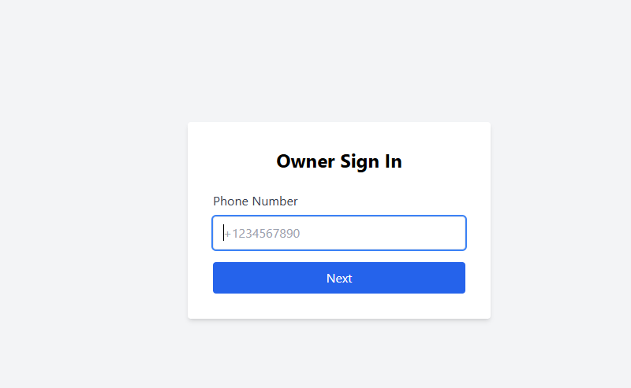
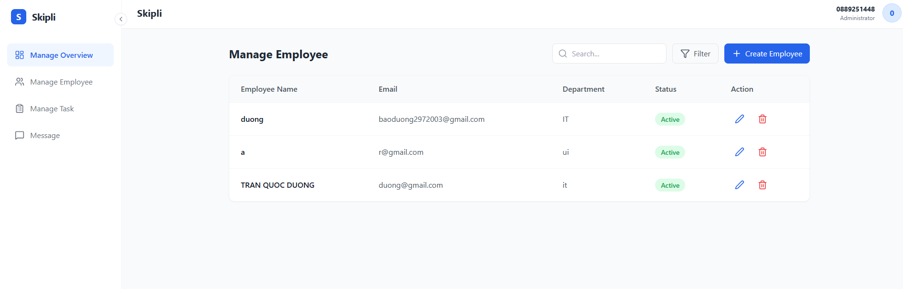
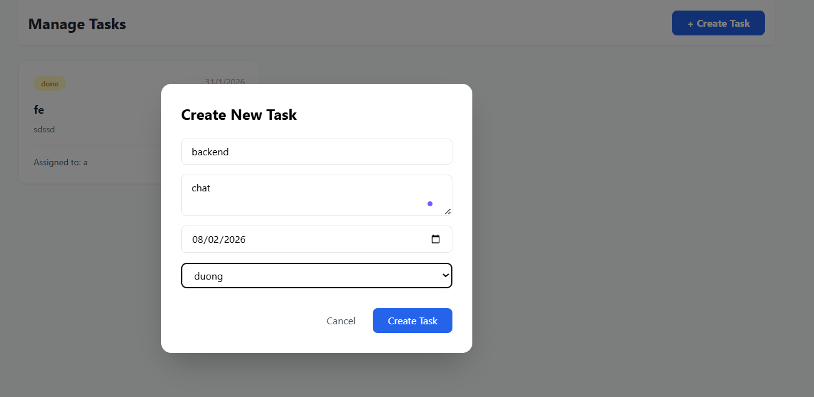
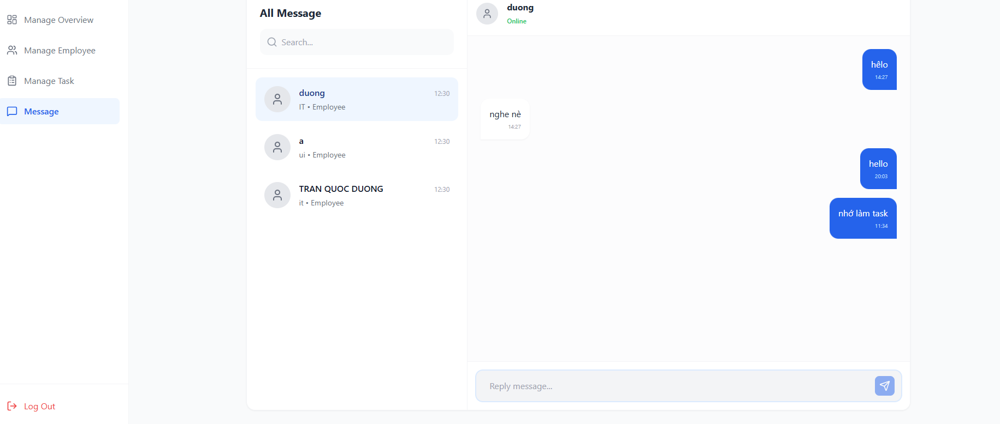
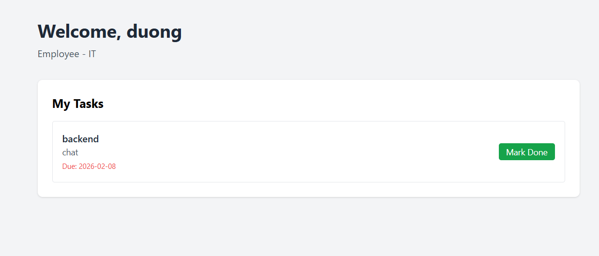
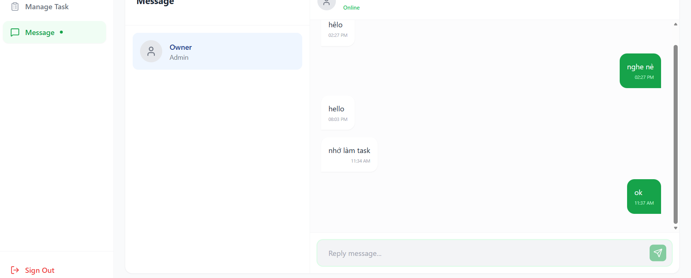

# tech_test


---

## Công nghệ sử dụng

**Frontend**
- React + Vite
- TailwindCSS
- Socket.io Client

**Backend**
- Node.js
- Express
- Socket.io
- Firebase Firestore

**Ngôn ngữ**
- TypeScript

---

## Chức năng chính

### 1. Owner
- Đăng nhập bằng **số điện thoại**  
  > Hiện tại chưa tích hợp SMS thật do cần mua dịch vụ, nên mã OTP sẽ được log ra terminal khi chạy backend.

- Quản lý nhân viên:
  - Thêm
  - Chỉnh sửa
  - Xóa
  - Xem danh sách
- Chat realtime với từng nhân viên
- Giao task và theo dõi tiến độ thực hiện

### Demo Owner
| Đăng nhập | Quản lý Employee |
| :---: | :---: |
|  |  |

| Tạo Task | Chat với Employee |
| :---: | :---: |
|  |  |


---

### 2. Employee
- Đăng nhập bằng **email** (mã xác thực được gửi qua email)
- Xem danh sách task được giao
- Thiết lập thông tin cá nhân khi đăng nhập lần đầu
- Chat realtime với Owner

### Demo Employee
| Đăng nhập | Thông báo Email |
| :---: | :---: |
|  |  |

| Danh sách Task | Chat với Owner |
| :---: | :---: |
|  |  |

---

## Cài đặt & Chạy project

**Yêu cầu môi trường**
- Node.js: `v22.22.0`

---

### Backend

```bash
cd backend
npm install
npm run dev


